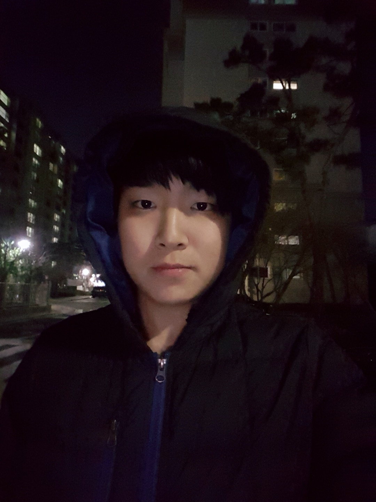

# Witty Photos - 더 똑똑한 갤러리
### 1. 프로젝트 소개
 현대인들은 이전에 비해 훨씬 방대한 양의 이미지를 생산해 내고 있으며, 때때로 개인이 갖는 이미지가 지나치게 많아지기도 합니다.
이 경우 사용자가 소유한 이미지들을 관리하는 것에 큰 어려움을 느끼게 되기도 합니다.
이에 저희 팀은 이러한 문제를 해결하고 사용자 소유의 사진 속 정보를 이용하여 사용자의 라이프 스타일을 파악할 수 있는 어플리케이션을 구상하였습니다.

### 2. 소개 영상

### 3. 팀 소개

#### 지도 교수 : 박하명 교수님

<h4> 정찬영(팀장) </h4>

-20133259  
  -Email : wjdckfrl55@naver.com  
  -자동 태그 기능 개발 및 데이터 베이스 설계  

   
  

<h4> 서민호 </h4>

-20123371  
  -Email : jackseo94@naver.com  
  -Android application 개발 및 UI/UX 담당  

   

<h4> 손민지 </h4>

-20123376  
  -Email : amyminjison@gmail.com  
  -Android application 개발 및 UI/UX 담당  

   

<h4> 이가빈 </h4>

-20153203  
  -Email : kv829ly@naver.com  
  -수동 태그 기능 개발 및 데이터 네트워크 알고리즘 구현  

   

<h4> 장지은 </h4>

-20133256  
  -Email : killkkk666@kookmin.ac.kr  
  -자동 태그 기능 개발 및 서버 구축  

   

